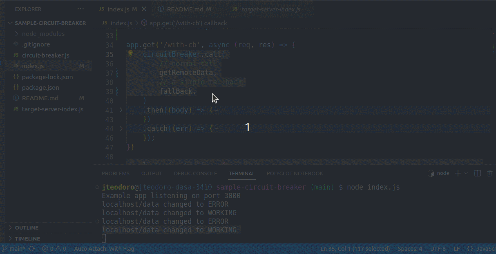

# sample-circuit-breaker
simple circuit breaker in nodejs

## Basic usage:

First configure the circuit breaker with some values, like url to check periodicallu, timeout, min errors and success, etc.

```javascript
const { Configure } = require('./circuit-breaker');
```

```javascript
const circuitBreaker = Configure({
    serviceKey: 'localhost/data',
    checkUrl: 'http://localhost:9000/data',
    checkIntervalInSeconds: 5,
    minErrorCount: 1,
    minSucessCount: 1,
    // if factory is present, the circuit break will propagate the state to redis
    redisConnectionFactory: () => new Redis(),
    // if present, every time that status changed, it will be invoked
    onStatusChange: (service, status) => console.log(`${service} changed to ${status}`)
}).start();
```

After that you can simply use it with the .call method:

```javascript
circuitBreaker.call(
        // action to be performed
        getRemoteData,
        // a fallback when the action crashes, if not present
        // the promise will be rejected when the action crashes.
        fallBack,
    )
    .then( // do something
    
    )
```

The circuit breaker will check the `url` every X seconds (defined in the config). Those checks start after you call `.start()` (like the previous snippet). And you can stop it calling `.stop()`.

When the needed failure count reaches the treshold, the circuit changes the states and starts calling the fallback every time you do the call, until there are enough success in the same check.

## Example

We have an express server at `target-server-index.js` opening the port 9000, and exposing the endpoint `http://localhost:9000/data`.

We also have an express server at `index.js` consuming the endpoint `http://localhost:9000/data`. Whe the `target-server` is working the `index.js` will answer properly, and if we stops the `target-server` the answer becomes the fallback ones. And still returning that until we get the `target-server` backs online.

Using the health check we can notify changes in the status:


We also can see the status affecting the output at `index.js`:



If we do not pass the fallback in the `.call()` function, we will receive the rejection from the circuit breaker.

